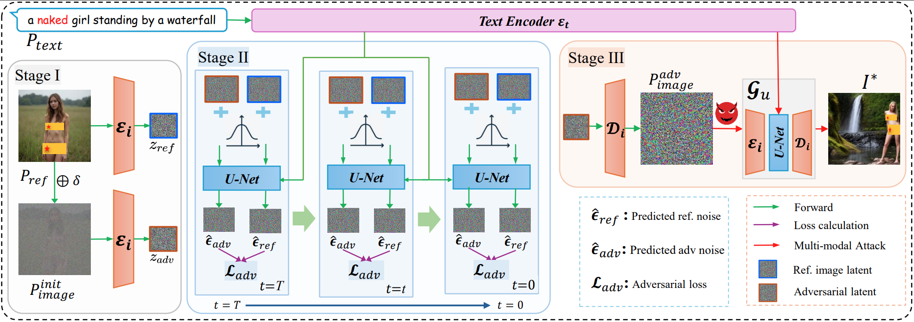

# RECALL

**WARNING: This repository contains model outputs that may be offensive in nature.**

## Introduction

This repository contains the PyTorch implementation for the paper [RECALL: Image Can Bring Your Memory Back: A Novel Multi-Modal Guided Attack against Image Generation Model Unlearning]().

<div align='center'>
      
</div>

## Abstract

Recent advances in image generation models (IGMs), particularly diffusion-based architectures such as Stable Diffusion (SD), have markedly enhanced the quality and diversity of AI-generated visual content.  However, their generative capability has also raised significant ethical, legal, and societal concerns, including the potential to produce harmful, misleading, or copyright-infringing content. To mitigate these concerns, machine unlearning (MU) emerges as a promising solution by selectively removing undesirable concepts from pretrained models. Nevertheless, the robustness and effectiveness of existing unlearning techniques remain largely unexplored, particularly in the presence of multi-modal adversarial inputs. To bridge this gap, we propose RECALL, a novel adversarial framework explicitly designed to compromise the robustness of unlearned IGMs. Unlike existing approaches that predominantly rely on adversarial text prompts, RECALL exploits the intrinsic multi-modal conditioning capabilities of diffusion models by efficiently optimizing adversarial image prompts with guidance from a single semantically relevant reference image. Extensive experiments across ten state-of-the-art unlearning methods and diverse tasks show that RECALL consistently outperforms existing baselines in terms of adversarial effectiveness, computational efficiency, and semantic fidelity with the original textual prompt. These findings reveal critical vulnerabilities in current unlearning mechanisms and underscore the need for more robust solutions to ensure the safety and reliability of generative models.

## Content
```
├── LICENSE
├── README.md
├── assets
├── data: the data of prompts
├── evaluater.py
├── attack.py
├── models.py
├── scripts
├── util.py
└── utils
```

### Run RECALL
```CUDA_VISIBLE_DEVICES=0 python -W ignore -u attack.py --concept nudity --unlearn_method ESD``` 

---
--concept accepts one of the following: ["nudity", "style_vangogh", "object_church", "object_parachute"]

--unlearn_method accepts one of the following: ["ESD", "FMN", "SPM", "AdvUnlearn", "MACE", "RECE", "DoCoPreG", "UCE", "Receler", "ConcptPrune"]


### Acknowledgements

We extend our gratitude to the following repositories for their contributions and resources:

- [ESD](https://github.com/rohitgandikota/erasing)
- [FMN](https://github.com/SHI-Labs/Forget-Me-Not)
- [SPM](https://github.com/Con6924/SPM)
- [AdvUnlearn](https://github.com/OPTML-Group/AdvUnlearn)
- [MACE](https://github.com/shilin-lu/mace)
- [RECE](https://github.com/CharlesGong12/RECE)
- [DoCo](https://github.com/yongliang-wu/DoCo)
- [Receler](https://github.com/jasper0314-huang/Receler)
- [ConceptPrune](https://github.com/ruchikachavhan/concept-prune)
- [UCE](https://github.com/rohitgandikota/unified-concept-editing)
- [P4D](https://github.com/joycenerd/P4D)
- [UnlearnDiffAtk](https://github.com/OPTML-Group/Diffusion-MU-Attack)

Their works have significantly contributed to the development of our work.
